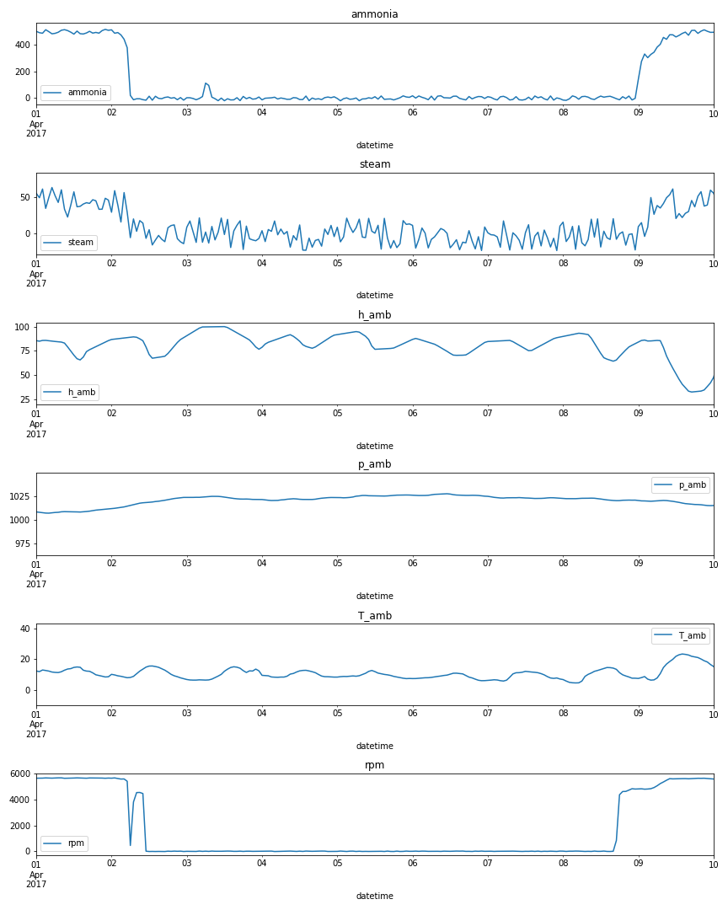
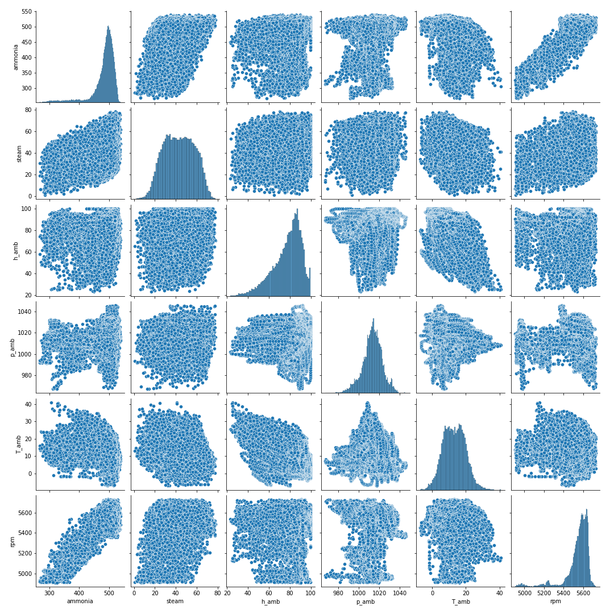
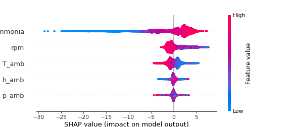

# Yara Data Science Assessment

The Yara use case has the following 4 items to solve for:
1. Some sensor data is missing or can have wrong (unreasonable) values. Propose and use a strategy to clean the data
1. The plant sometimes undergoes through so called “downtimes” – planned and unplanned periods of low or no production. Propose and implement a strategy for filtering out such downtime periods. For your analysis, please use only stages when the plant is up and running
1. Propose and implement strategy for model training and testing
1. With a method of your choice, explain importance of each parameter in the model – ideally covering both direction and magnitude of their impact on model target

## Basic Data Overview

The dataset consists of 32855 samples with 7 parameters, measured hourly:

- utctimestamp
- 01FI1103/AI1/PV.CV - production of steam in tons/hour
- 01FI1101E/PV.CV - consumption of ammonia in tons/hour
- 01TI1538/AI1/PV.CV - ambient (outside) temperature in degrees Celcius
- 60PI0496/AI1/PV.CV - ambient (outside) pressure in mbara
- 01AI1923/AI1/PV.CV - ambient (outside) humidity in %
- 01HC1955/PID1/PV.CV - speed of compressor in rpms (revolutions per minute)

The ambient parameters are independent variables influenced solely by time of year and weather. The remaining 3 parameters are specific to the production process. Target parameter to prdict is the steam production.

## Step 1. Data Exploration and Cleaning

For simplicity the parameters will be renamed to reflect the measured quantity.

- 01FI1103/AI1/PV.CV: steam
- 01FI1101E/PV.CV: ammonia
- 00TI0538/AI1/PV.CV: T_amb
- 60PI0496/AI1/PV.CV: p_amb
- 01AI1923/AI1/PV.CV: hum_amb
- 01HC1955/PID1/PV.CV: rpm

In the figure below, the measurement data is plotted over time.

Most notably, the steam and ammonia production and compressor rpm show dips, which likely indicate production downtime. The below figure shows the first downtime event occurring between April 1 and April 10, 2017.

The signal-to-noise-ratio for the steam production sensor is low, indicating that building a model on raw sensor data may not be able to infer significant information from the signal.

According to the observation, downtimes will be filtered out based on the compressor speeds below 4900 rpm, steam production that is negative and ammonia production below 200t/h.

Checking for missing values shows that `hum_amb` and `T_amb` both have 6 missing values in the same points in time, `p_amb` has 279 missing values. The missing value samples are << than 1% of the total samples, and are be dropped without significant data loss.

The following data cleaning steps are implemented:

1. Removal of production downtime, by filtering samples with compressor speeds below 4900rpm. Other dips are visible that do not entail a complete shutdown, that should be covered in the model.
1. Filtering of samples with negative steam production, this may not be physically accurate
1. Dropping samples with missing values
1. Rolling average denoising of steam production signal

## Step 2. Basic Data Statistics

The plot below shows sample correlation and distributions.

The data shows mostly normal-like distributions. There seems to be a almost linear correlation between compressor rpm and ammonia consumption.

## Step 3. Model Testing

Due to the low number of parameters and low VIF scores, multi-colinearity can be eliminated.

Most notably the following methods could prove useful:
 - LinearRegression
 - ElasticNet
 - RandomForest
 - XGBoost

## Result Table

Without denoising of steam production signal:

| Method | Avg CV Score |
|:------:|:-----:|
| LinearRegression | 0.056 |
| EalsticNet | 0.056 |
| RandomForest | 0.014 |
| XGBoost | 0.044 |

With denoising of steam production signal:

| Method | AVG CV Score |
|:------:|:-----:|
| LinearRegression | 0.18 |
| ElasticNet | 0.18 |
| RandomForest | 0.11 |
| XGBoost | 0.17 |

As all model perform better with a rudimentary signal smoothing for the steam production signal, potential exists in improving the model, by improving signal-to-noise-ratio if possible.
The random forest model by definition can provide feature importance and direction explicitly:

### RandomForest Model

The RandomForest model shows the following picture in terms of feature importance and direction, as calculated by SHAP:

## Possible Next Steps

1. Improve steam production measurement
1. Fine tune models (e.g. GridSearchCV, etc.)
